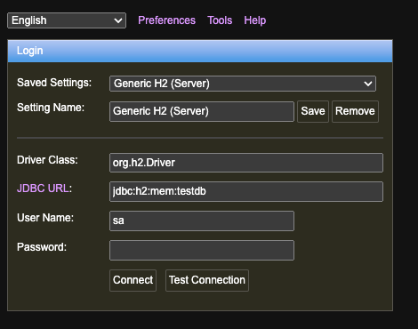

GraphQL Cheatsheet

1. Add 4 modules to start with:
   * Config
   * Resolver
   * Service
   * Model
   
2. Under resources, add module "graphql" and add schema.graphqls file to define the schema
   * Add the schema - types, enums, input, query, mutation - use clear naming conventions (e.g., PascalCase for types, camelCase for fields).

3. Create resolvers for each query and mutation, handling the business logic. Also, need to implement custom logic for the DateTime scalar to ensure proper serialization and deserialization of date/time values


#### Basic Outline

- Dependency Handling: Implement logic to handle task dependencies (e.g., ensure dependencies are completed before executing a task).
- Recurrence: Implement logic to handle different recurrence schedules (DAILY, WEEKLY, MONTHLY, CUSTOM).
- Error Handling: Implement error handling for task execution and other operations.
- Task Status Updates: Update task status appropriately as tasks progress.
- Persistence: Use a suitable persistence layer (e.g., Spring Data JPA) to manage task data.
- GraphQL Tools: Use a GraphQL library like GraphQL Tools to integrate the resolver and service with your GraphQL API.

### Support for in-memory DB
   - For Gradle (build.gradle): `runtimeOnly 'com.h2database:h2'`
   - And JPS - `  implementation 'org.springframework.boot:spring-boot-starter-data-jpa'`
   - jdbc:h2:mem:testdb: This sets up an in-memory database that will be destroyed when the application stops.
   - spring.h2.console.enabled=true: This enables the H2 console, allowing you to view the database content at http://localhost:8080/h2-console.
   - Use JPA Annotations: You can now use JPA entities in your application.
      ```java
      @Entity
      public class User {
          @Id
          @GeneratedValue(strategy = GenerationType.IDENTITY)
          private Long id;
          
          private String name;
          
          private String email;
      
          // Getters and Setters
      }
      ```
     - Access H2 Console via Browser
       If you're using Spring Boot, you can access the H2 console through a web browser as well:
         - Run your Spring Boot application.
         - Open a browser and go to http://localhost:8080/h2-console.
         - Use the JDBC URL: jdbc:h2:mem:testdb, username sa, and leave the password blank.
         - 
     

Related
How can I implement recurring tasks in a GraphQL schema
What are the best practices for defining priority levels in a GraphQL schema
How do I model dependencies between tasks in a GraphQL schema
Can you provide an example of a GraphQL schema with recurring tasks and dependencies
How do I handle task dependencies in a GraphQL mutation
